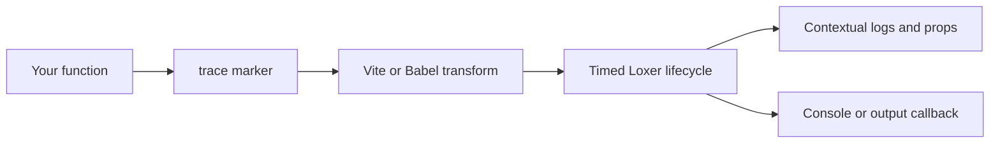

# Loxer: make execution flow visible

Most logs tell you what happened. Loxer shows where it happened, what came before it, how long it
took, and how concurrent work fits together. Mark a normal function, let your build transform it,
and each call becomes a readable lifecycle with the logs, data, and failures that belong to it.

## See the whole operation, not a pile of lines



The transform removes the marker and adds the lifecycle code. Your function retains its arguments,
`this`, return value, thrown error, and native Promise identity. The runtime opens a box at the start
of a call and closes it on a return, throw, fulfillment, or rejection. Calls that overlap remain
separate, even when their logs interleave.

## From function to trace

This is the complete shape of a traced function. [The quick start](./quick-start.md) supplies the
Vite setup that transforms it.

```ts
import { Loxer, type LoxerModules } from 'loxer';
import { trace } from 'loxer/trace';

const modules = {
  ORDER: { color: '#73e2a7', fullName: 'Order', devLevel: 'debug', prodLevel: 'error' },
} satisfies LoxerModules;

declare module 'loxer' {
  interface LoxerModuleRegistry extends Record<keyof typeof modules, true> {}
}

Loxer.init({ dev: true, modules });

async function submitOrder(orderId: string) {
  trace.point.ORDER.info('Persisting the submitted order', { orderId });
  await new Promise((resolve) => setTimeout(resolve, 16));
  return { orderId, status: 'submitted' };
}

trace.ORDER.props('result').info(submitOrder);
```

Calling `submitOrder('A-42')` writes one lifecycle. This is the default development stream in a
120-column terminal:


The opening record establishes the work. The trace point becomes an event inside it. The return value
is attached to the closing record because `.props('result')` selected it. If the function throws or
its Promise rejects, Loxer records the error in the same box, closes it as failed, and rethrows the
original failure.

## What Loxer can do

### Trace real work

Instrument synchronous or `async` functions, including nested calls. Use names, argument types,
arguments, results, or message callbacks to make the lifecycle speak the language of your domain.

```ts
trace.ORDER.info(submitOrder, {
  openMessage: 'parent.fn(args)',
  closeMessage: ({ result, fn }) => fn(result.status),
});
```

### Place milestones in the flow

`trace.point` adds a contextual record without opening a new box. It is useful for validation,
retries, cache decisions, remote calls, and any event that needs the surrounding function context.

```ts
trace.point.ORDER.info('Inventory reserved', { orderId });
trace.point.ORDER.warn('Retrying payment provider', { attempt: 2 });
```

### Separate domains without losing the story

Modules give an area of the application a name, color, and visibility threshold. A log has a level;
a module logs up to its configured threshold in development and production. The threshold decides
whether to emit a record and preserves the level that a caller chose.

```ts
const modules = {
  ORDER: { color: '#73e2a7', fullName: 'Order', devLevel: 'debug', prodLevel: 'info' },
  PAYMENT: { color: '#e68cff', fullName: 'Payment', devLevel: 'info', prodLevel: 'error' },
} satisfies LoxerModules;
```

### Keep standalone logs useful

Use the same modules, levels, highlighting, props, history, and output pipeline where an event does
not need inferred function context.

```ts
Loxer.m('ORDER').h().info('Order accepted', { orderId });
Loxer.m('PAYMENT').debug('Provider response', response);
Loxer.error(new Error('Payment failed'));
```

### Build a flow manually

Some work lives outside code a build transform can reach: event emitters, callbacks from libraries,
or flows assembled from several entry points. Open a box explicitly and assign records to it.

```ts
const box = Loxer.m('ORDER').info.open('Submit order');
Loxer.of(box).add('Basket validated');
Loxer.of(box).warn('Inventory is low');
Loxer.of(box).close('Order complete');
```


### Send structured events where they belong

Production has no default output. Give `Loxer.init()` one callback to forward visible logs and errors
to your own logger, error reporter, metrics pipeline, or storage.

```ts
Loxer.init({
  output(event) {
    if (event.kind === 'error') {
      reportError(event.lox, event.history);
      return;
    }

    publish({
      level: event.lox.level,
      message: event.lox.message,
      moduleId: event.lox.moduleId,
      props: event.lox.props,
    });
  },
});
```

Output events carry structured fields, so a destination can retain values without parsing console
text. `OutputLoxRenderer`, `ErrorLoxRenderer`, and `PropsPrinter` are available when it needs the
same text rendering as the console.

## Pick your path

| Your goal | Start here | Then go to |
| --- | --- | --- |
| See a real trace in a browser | [Five-minute Vite trace](./quick-start.md) | [Tracing](./tracing.md) |
| Add tracing to an existing app | [Integrations](./integrations.md) | [Tracing](./tracing.md) |
| Use logs, modules, props, or manual boxes | [Logging, output, and manual flows](./logging.md) | [Reference](./reference.md) |
| Send production records to a service | [Output and data policy](./logging.md#output-and-data-policy) | [Reference](./reference.md#performance) |
| Fix a marker or missing-output problem | [Reference and troubleshooting](./reference.md) | [Integrations](./integrations.md) |
| Look up an exact type or option | [Generated API reference](https://pcprinz.github.io/loxer/index.html) | — |

## The pieces that work together

| Piece | Job | Use it when |
| --- | --- | --- |
| `trace` | Creates a function lifecycle at build time | A named function represents meaningful work |
| `trace.point` | Writes one contextual milestone | An event belongs inside a traced function |
| `Loxer` | Writes standalone logs and errors | The event does not need inferred function context |
| Modules | Name, color, and gate an area | You need environment-specific visibility by domain |
| Props | Attach raw values to a record | A human or output destination needs supporting data |
| `output` | Receives visible structured events | Production needs a destination beyond the console |
| `open()` / `of()` | Creates manual lifecycle boxes | A transform cannot reach the code or the flow is explicit |

## A realistic nested workflow

The order operation below opens one box. The payment call opens a nested box. The direct `Loxer`
call inside payment joins the payment box, and an output callback receives each visible event.

```ts
async function chargePayment(orderId: string) {
  Loxer.m('PAYMENT').debug('Calling payment provider', { orderId });
  return { orderId, authorized: true };
}
trace.PAYMENT.info(chargePayment, { closeMessage: 'fn(result)' });

async function submitOrder(orderId: string) {
  trace.point.ORDER.info('fn', 'Order accepted', { orderId });
  const payment = await chargePayment(orderId);
  return { orderId, payment };
}
trace.ORDER.props('result').info(submitOrder, { openMessage: 'parent.fn(args)' });
```

This is the pattern to use for an operation with meaningful internal stages. The [tracing guide](./tracing.md)
covers marker forms, callbacks, captured arguments/results, highlights, async behavior, and transform
limits.


## Operational facts worth knowing

- Call `Loxer.init()` early. Logs emitted before it waits in a bounded queue containing the oldest
  1,000 entries. A one-time console warning appears after five seconds without initialization.
- Every loaded copy of Loxer in one JavaScript realm resolves to one `globalThis`-backed instance.
  Workers, iframes, and server processes are separate realms and need their own initialization.
- Messages, arguments, results, errors, and props are caller data. Loxer does not redact them. Filter
  output events and configure access, retention, encryption, and deletion at the destination.
- A trace marker must pass through Vite or Babel. A marker that executes untransformed throws a
  configuration error rather than quietly doing nothing.
- Render props only when people need them. Use `depth` or `keys` to constrain wide values, and retain
  raw `lox.props` when structured forwarding is the goal.

## Where each guide goes deeper

- [Quick start](./quick-start.md) is the tested, copyable Vite path from install to browser output.
- [Tracing](./tracing.md) owns marker forms, points, messages, captures, highlights, async behavior,
  and manual-tracing boundaries.
- [Logging, output, and manual flows](./logging.md) owns initialization, levels, modules, props,
  manual boxes, history, output, renderers, and data handling.
- [Integrations](./integrations.md) owns Vite, Babel, test-runner, Node-build setup, verification,
  and transform fallbacks.
- [Reference](./reference.md) owns diagnostics, limits, performance context, and migration notes.

The authored guides explain tasks. The [generated API reference](https://pcprinz.github.io/loxer/index.html)
owns exhaustive signatures, option fields, and supporting types. Adapter package READMEs own
adapter-specific installation and maintenance details.
