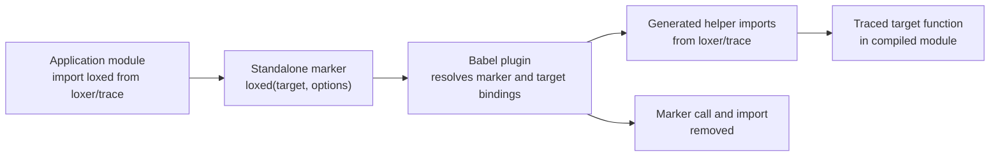
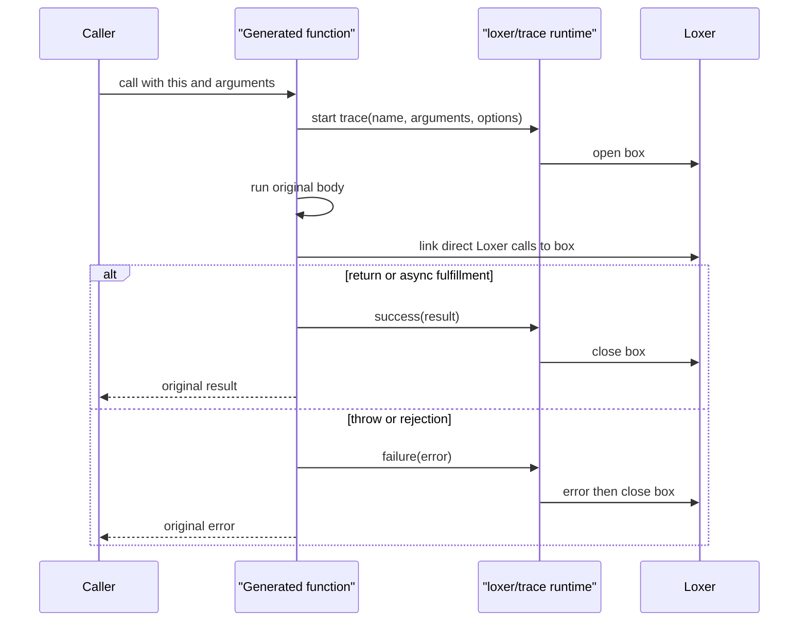

# Babel plugin for Loxer traces

`babel-plugin-loxer-trace` turns an explicit `loxed()` marker into runtime code that traces a
named plain function with Loxer boxes. It is the canonical transform: the Vite companion package
delegates to this package instead of implementing a second transform.

The package is ESM-only and publishes its compiled `dist/` directory. It requires Node 22.18 or
newer, Babel 8, and Loxer 3. Install it alongside the build tools that transform your application
source.

```sh
pnpm add -D babel-plugin-loxer-trace @babel/core
pnpm add loxer
```

## Using the plugin

Register the default export in the Babel configuration that parses the files containing markers.
For TypeScript, enable Babel's TypeScript preset in that same configuration.

```js
// babel.config.mjs
export default {
  presets: ['@babel/preset-typescript'],
  plugins: ['babel-plugin-loxer-trace'],
};
```

In application code, import the marker from `loxer/trace`, declare a named function, and place the
marker immediately after its binding.

```ts
import { Loxer } from 'loxer';
import { loxed } from 'loxer/trace';

async function submitOrder(orderId: string) {
  Loxer.m('PAYMENT').log(`charging ${orderId}`);
  return charge(orderId);
}

loxed(submitOrder, {
  moduleId: 'ORDER',
  openMessage: 'args',
  closeMessage: 'result',
});
```

`loxed()` is deliberately not a runtime wrapper. If it runs in the browser or Node, the build step
was skipped and it throws a configuration error. A successful transform removes both the marker
call and the marker import.

## What the transform does

The plugin identifies the _binding_ imported as `loxed`, rather than transforming every call with
that spelling. This keeps unrelated local functions named `loxed` untouched. For each valid marker,
it adds collision-safe imports for internal helpers from `loxer/trace`, rewrites the selected
function body, and removes the marker import when it is no longer used.



The generated function opens a Loxer box before calling the original body. It attaches direct Loxer
calls in that body to the box, records success when the function completes, and records failure
before rethrowing the original error. Runtime helper imports, rather than names looked up in the
consumer's scope, keep generated code safe when application code shadows globals.



For an ordinary function that returns a native Promise, the transform observes settlement but
returns the same Promise object to the caller. An `async` function is traced through its awaited
result. This preserves the observable sync/async result and native Promise identity.

## API and source layout

The package exports three things from `src/index.ts`:

- the default Babel plugin;
- `transformLoxerTrace(code, options)`, a configuration-free async helper for transforming one
  module string; and
- the plugin and helper option types.

| Source file            | Responsibility                                                                                                                                              |
| ---------------------- | ----------------------------------------------------------------------------------------------------------------------------------------------------------- |
| `src/index.ts`         | Public ESM export surface for the plugin, helper, and option types.                                                                                         |
| `src/plugin.ts`        | Babel Program visitor. Resolves marker and target bindings, validates marker syntax, injects internal runtime imports, and coordinates each target rewrite. |
| `src/trace-binding.ts` | Creates the traced wrapper body and rewrites eligible direct `Loxer` modifier/logging chains so their records share the trace box.                          |
| `src/transform.ts`     | Provides `transformLoxerTrace`, which calls Babel with no project Babel config and accepts filename, parser-plugin, import, and source-map options.         |
| `src/types.ts`         | Defines the public plugin and one-off transform options, plus the Babel type-builder type used internally.                                                  |

Use `transformLoxerTrace` when another tool already owns file discovery and wants to provide the
source text directly. Supply `parserPlugins` for syntax Babel cannot infer from the string, such as
`['typescript']` or `['jsx']`. The helper defaults to source maps and does not read a `babelrc` or
`configFile`, so its behavior stays limited to this plugin and the options you pass.

`traceImport` and `loxerImport` let an integrator point the transform at alternative module
specifiers. They default to `loxer/trace` and `loxer` respectively.

## Relationship with Vite

For Vite applications, configure `vite-plugin-loxer-trace` instead of manually calling the Babel
plugin. The Vite adapter runs with `enforce: 'pre'`, filters JavaScript/TypeScript and JSX/TSX
modules before Vite's usual transforms, derives the required Babel parser plugins from the filename,
and asks this package for source maps. Vite then composes those maps with later transforms.

```ts
// vite.config.ts
import { defineConfig } from 'vite';
import loxerTrace from 'vite-plugin-loxer-trace';

export default defineConfig({
  plugins: [loxerTrace()],
});
```

The Vite package is an adapter, not an alternative tracing implementation. Fix transform behavior
here, then ensure the adapter continues to pass the correct parser and source-map options.

## Supported shapes and boundaries

The marker supports:

- named function declarations;
- named variables initialized with a function expression; and
- named variables initialized with an arrow function.

The transformed callable preserves its `this` behavior, real arguments, observable `.length`, named
function-expression recursion, synchronous result, thrown value, async settlement, and native
Promise identity. It supports one marker per target and accepts an optional normal options
expression.

These boundaries are intentional:

- The marker must be a standalone statement beside its named binding: `loxed(target, options)`.
  It cannot be used as an expression, target an anonymous value, or receive a spread options
  argument.
- Generator and async-generator functions are not supported.
- Only direct calls on the imported `Loxer` binding in the transformed function body are linked to
  the trace. Nested functions, detached aliases, and indirect logger calls remain ordinary Loxer
  calls unless they are marked independently.
- An object that merely looks like a thenable is not treated as a native Promise result. The
  function returns it unchanged and its trace completes synchronously.
- The marker is a build-time contract. Keep this plugin in every Babel/Vite path that executes a
  module containing `loxed()`.

## Maintaining the package

Build the package from the repository root with:

```sh
pnpm --filter babel-plugin-loxer-trace build
```

For transform or runtime changes, run the focused plain-function trace tests when iterating, then
run the full repository test suite when the behavior reaches Loxer's runtime:

```sh
pnpm test -- plain-function-trace
pnpm test
```

Generated code is part of the public behavior. Add fixtures for callable semantics, hostile thrown
values, and shadowed application globals whenever changing the transform or its runtime helpers.
